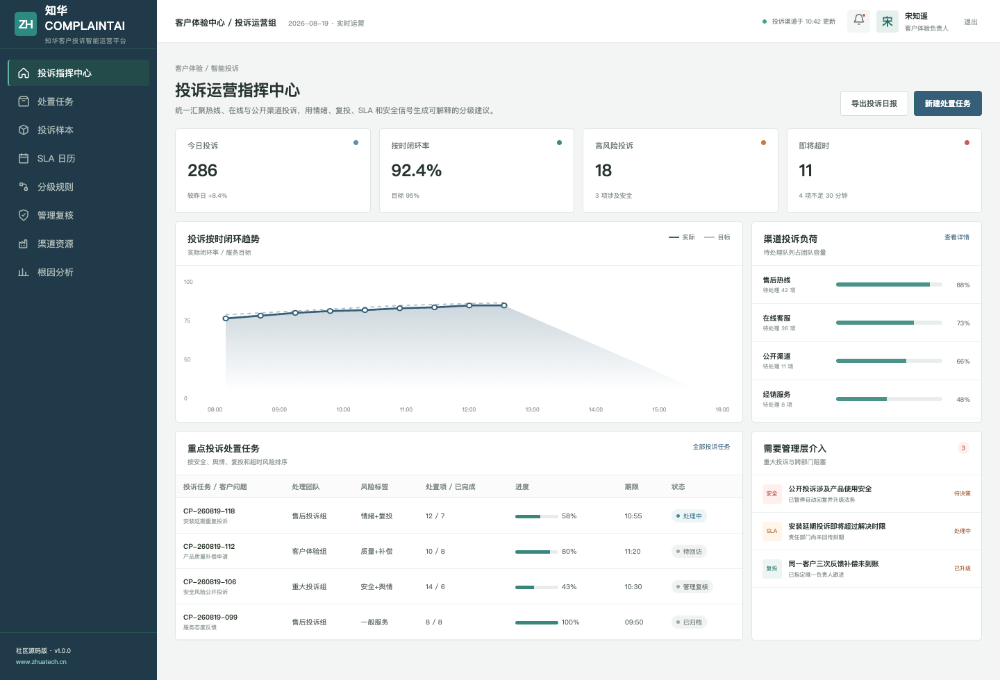
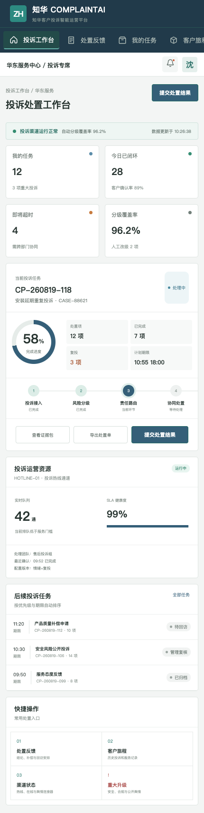

<div align="center">

# ZhuaTech ComplaintAI

### 知华客户投诉智能运营平台 · 社区源码版

**投诉分级、SLA 路由、跨部门处置与回访闭环**

[知华科技官网](https://www.zhuatech.cn/) · 上海如静知华信息科技有限公司

</div>

> [!IMPORTANT]
> 本工程仅限个人非商业学习、研究和技术交流，不得商用。企业内部使用、生产部署、SaaS、实施交付、收费服务、品牌替换或商业再发行，须事先取得上海如静知华信息科技有限公司书面授权，详见 [LICENSE](LICENSE)。

ComplaintAI 面向客户体验、售后服务和投诉管理团队。它将热线、在线和公开渠道的投诉放入统一队列，用客户情绪、重复投诉、SLA 超时、安全合规、补偿金额和舆情暴露生成可解释的风险分级；重大事项始终由人工确认。



## 已实现的处置闭环

- `LOW / MEDIUM / HIGH / CRITICAL` 四级投诉风险
- 标准服务、专家复核、管理层升级三类责任队列
- 15—480 分钟动态响应时限与超时预警
- 投诉任务、客户旅程、SLA 日历、根因分析和管理复核
- 管理驾驶舱与投诉专员响应式 H5 工作台
- JWT、MySQL、Flyway、Docker Compose、JUnit 与 MockMvc

核心接口：`POST /api/ai/complaint/analyze`。社区版采用本地确定性策略，不需要外部模型密钥。



## 本地体验

```bash
cd frontend
npm install
npm run dev:demo
```

访问 `http://localhost:5173`，管理端账号 `planner / Demo@2026`，业务端账号 `operator / Demo@2026`。演示客户、投诉、金额和人员均为虚构数据。

后端包名：`cn.zhuatech.complaintai`。更多资料：[API](docs/api.md) · [架构](docs/architecture.md) · [数据库](docs/database.md) · [部署](deploy/README.md)

## 项目合作

需要投诉管理、客户体验、智能客服、CRM/工单集成、AI 私有化、软件外包或深度开发定制，请联系[知华科技](https://www.zhuatech.cn/)：

| 方案咨询 | 商业授权与定制 |
| --- | --- |
|  |  |

SEO：投诉管理系统、AI 投诉分级、客户体验管理、投诉 SLA、Java Vue 源码、知华科技。
